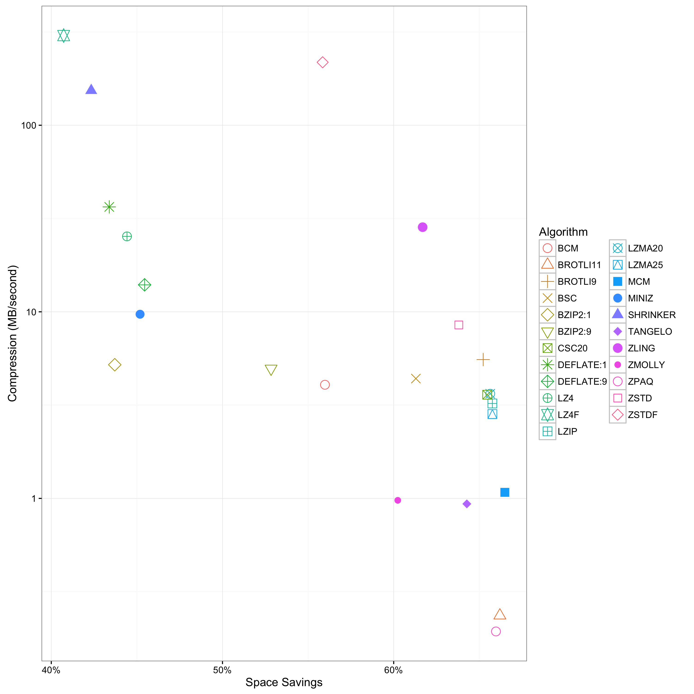
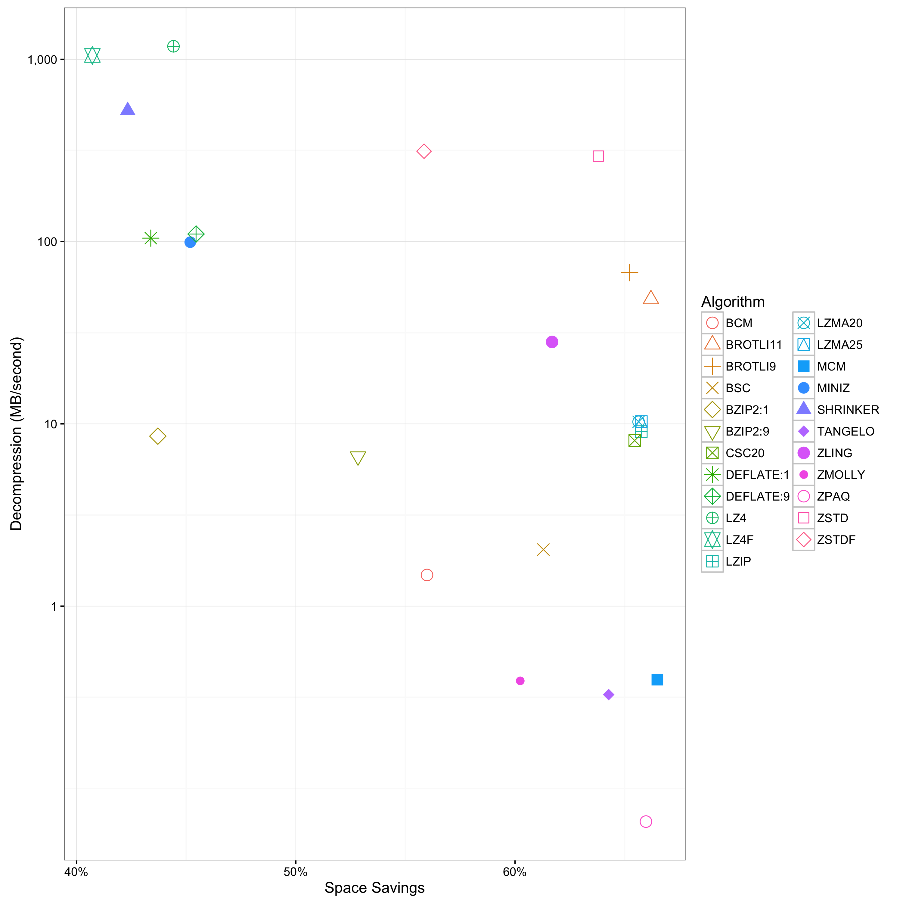
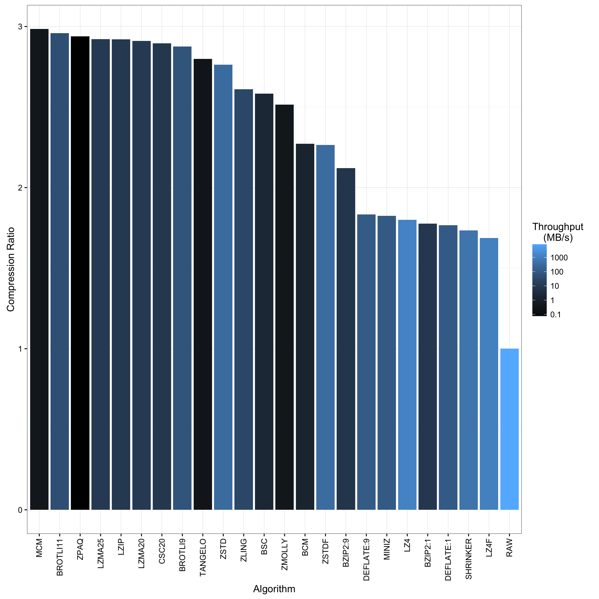
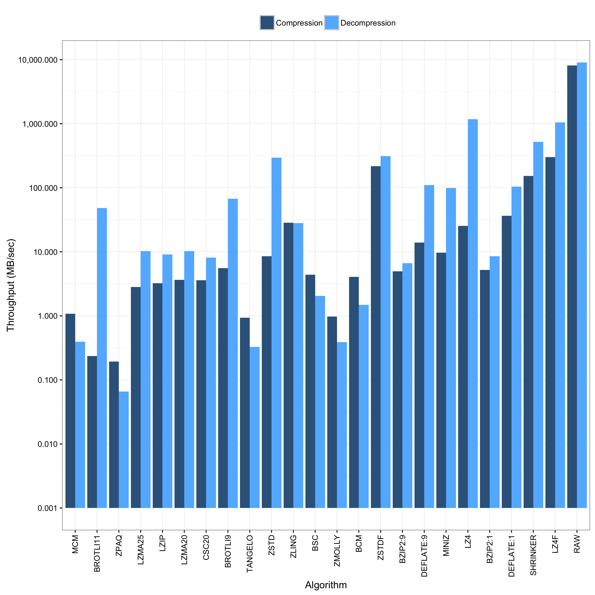
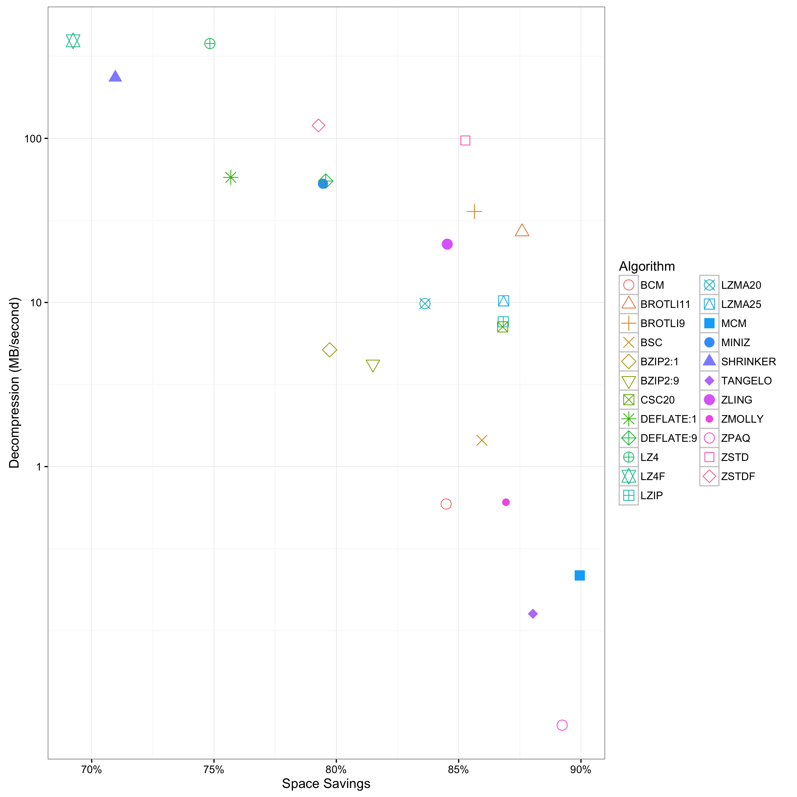
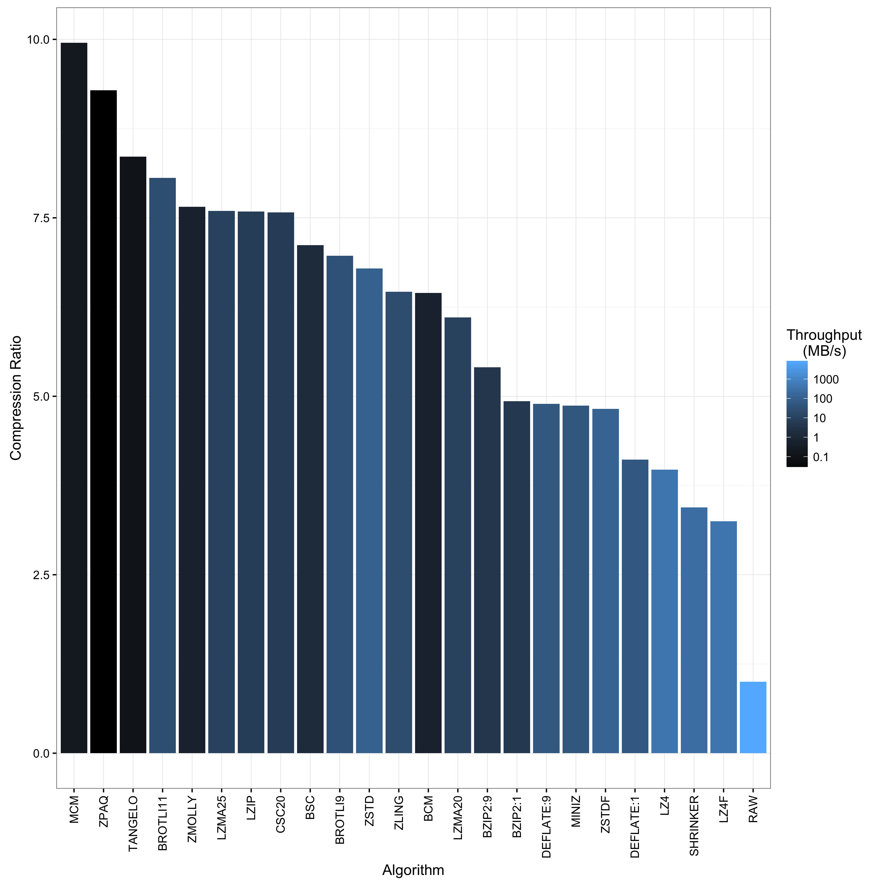
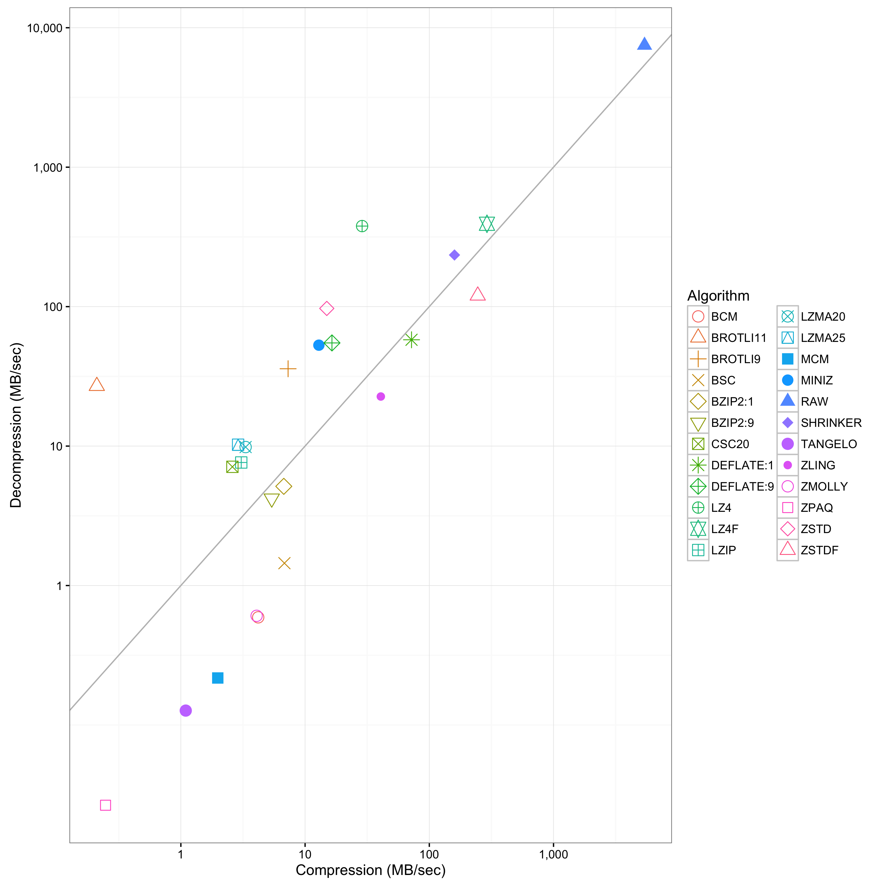
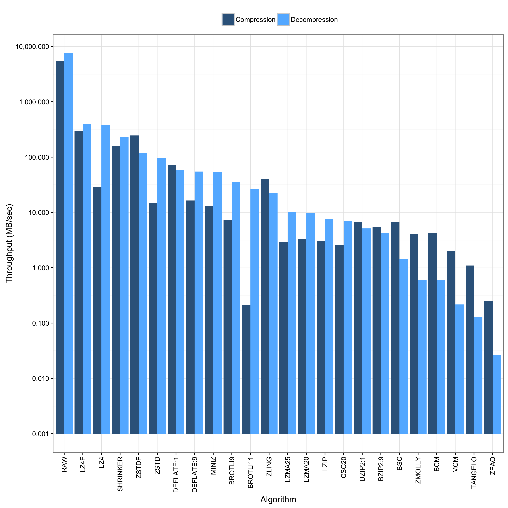

A benchmark utility to examine and compare various compression algorithms,
based on [bundle](https://github.com/r-lyeh/bundle).

### Usage

Clone with `--recursive` and build with `make`. Then run

    ./benchmark < input > log

where `input` is the data you want to run through the various algorithms
Thereafter, generate the plots:

    ./plot [prefix] [format] < log

You will find several plots in the current directory for your perusal. The
optional argument `prefix` sets a file prefix and `format` defaults to `png`.

### Examples

To illustrate, we use a 850 MB PCAP trace ([2009-M57-day11-18][M57]), plus a
derived 5.3 MB of [Bro](https://www.bro.org) ASCII logs. The trace consists of
8505 connections from standard protocols, such as DNS, HTTP, DHCP, SSL, SMTP,
and FTP. We conducted our experiments on a 64-bit FreeBSD system with two
8-core CPUs and 128 GB of RAM. To reproduce the input data, download the trace
and run Bro on it as follows:

    bro -r trace.pcap

Thereafter, typing `make` generates in the `screenshots` directory the plots
below.

#### PCAP input

The above plots shows the trade-off space between space savings and
compression, as well as space savings versus decompression. The further a point
lays in the top-right corner the better it performs across both dimensions.

The above plot ranks the algorithms with respect to their compression ratio.
The algorithm with the highest compression ratio appears on the left. The
coloring corresponds to the decompression throughput in MB/sec and uses
light blue to highlight those algorithms with fast decompression.

The above plot contrasts compression versus decompression throughput. The
x-axis shows compression and the y-axis decompression performance in MB/sec. A
point above the y=x diagonal means that it has high decompression than
compression throughput. The converse holds for points below the diagonal. The
further a point appears in the top-right corner, the higher its combined
performance. Note that this algorithm does not profile compression ratio.

The above plot shows the same information as the previous plot, but also
includes the compression ratio in that the left-most algorithm exhibits the
highest compression ratio.

#### Bro input

The next figures show the same plot types for Bro ASCII logs generated from the
above trace:

### License

The above plots come with a [Creative Commons Attribution 4.0 International
License](http://creativecommons.org/licenses/by/4.0/), while the code ships
with a 3-clause BSD license.

[M57]: http://digitalcorpora.org/corpora/scenarios/m57-patents-scenario
